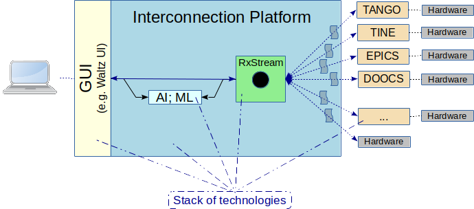

[](https://travis-ci.org/waltz-controls/magix-war-plugin)

# Magix Waltz-Controls war plugin

This plugin implements the "Green box" aka Magix from the diagram below:



## Usage

Deploy to Tomcat

Broadcast a message:
```
POST http://localhost:8080/magix/api/broadcast   
                
{"action": "read", "target":"tango","payload":[{"host":"hzgxenvtest:10000","device": "sys/tg_test/0","name": "double_scalar"}]}
```                 

Or to a specific channel:
```
POST http://localhost:8080/magix/api/broadcast?channel=private   
                
{"action": "read", "target":"tango","payload":[{"host":"hzgxenvtest:10000","device": "sys/tg_test/0","name": "double_scalar"}]}
```                                                           

Message format is defined in Waltz-Controls [RFC-1](https://github.com/waltz-controls/rfc/tree/master/1)

Subscribe to SSE:

```
GET http://localhost:8080/magix/api/subscribe 
```


